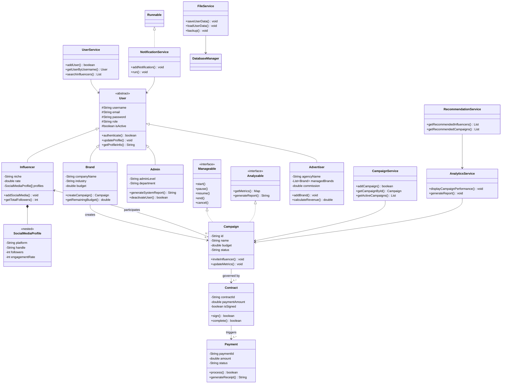

# Influencer Manager Platform - Project Documentation

## Table of Contents
1. [Project Overview](#project-overview)
2. [System Architecture](#system-architecture)
3. [Class Structure](#class-structure)
4. [UML Diagram](#uml-diagram)
5. [Implementation Details](#implementation-details)
6. [Object-Oriented Design Features](#oo-features)
7. [Advanced Java Features](#advanced-features)
8. [Security and Performance](#security-performance)
9. [Future Enhancements](#future-enhancements)

## 1. Project Overview <a name="project-overview"></a>

The Influencer Manager Platform is a comprehensive Java-based social media collaboration system that connects brands with influencers for marketing campaigns. The platform serves as a bridge between social media influencers, brands, advertisers, and administrators, facilitating seamless collaboration, campaign management, and performance tracking across major social media platforms including Instagram, YouTube, TikTok, and Twitter.

### Key Objectives:
- Enable efficient discovery of influencers by brands based on niche, engagement rates, and audience demographics
- Provide a robust campaign management system with automated contract handling and payment processing
- Implement AI-driven recommendations for influencer matching
- Support role-based access control with secure authentication
- Deliver real-time analytics and performance dashboard

### Core Features:
- **User Management**: Role-based access for Admins, Influencers, Brands, and Advertisers
- **Campaign Management**: Full lifecycle management from creation to completion
- **Analytics Dashboard**: Real-time performance metrics and reporting
- **Contract and Payment Processing**: Automated workflow for legal and financial transactions
- **AI Recommendations**: Intelligent matching algorithms for brand-influencer pairing
- **Multi-platform Integration**: Support for major social media platforms

## 2. System Architecture <a name="system-architecture"></a>

The platform follows a layered architecture pattern, ensuring separation of concerns and maintainability:

### Presentation Layer
- Console-based user interface implemented using Java Scanner class
- Menu-driven navigation system
- Role-specific dashboards and functionalities

### Service Layer
- Business logic implementation
- Core services: UserService, CampaignService, AnalyticsService, RecommendationService, NotificationService, FileService
- Implements business rules and workflows

### Model Layer
- Domain objects representing core entities
- User hierarchy with abstract User class and concrete implementations
- Campaign, Contract, and Payment entities

### Utility Layer
- Authentication management
- Database operations simulation
- File handling utilities

### Exception Layer
- Custom exception handling
- AuthenticationException and DataProcessingException

### Interface Layer
- Manageable and Analyzable interfaces
- Contract definitions for component behavior

## 3. Class Structure <a name="class-structure"></a>

### Core Class Hierarchy:

#### Abstract User Class:
```
User (Abstract)
├── Admin
├── Influencer
├── Brand
└── Advertiser
```

#### Services:
- **UserService**: User management operations
- **CampaignService**: Campaign lifecycle management
- **AnalyticsService**: Performance reporting and metrics
- **RecommendationService**: AI-driven matching algorithms
- **NotificationService**: Asynchronous notification processing
- **FileService**: Data persistence operations

#### Domain Objects:
- **Campaign**: Represents marketing campaigns
- **Contract**: Legal agreements between parties
- **Payment**: Financial transactions
- **Influencer.SocialMediaProfile**: Nested class for platform profiles

## 4. UML Diagram <a name="uml-diagram"></a>

The system's UML diagram illustrates the relationships between classes and their interactions:



## 5. Implementation Details <a name="implementation-details"></a>

### 5.1 User Management
The system implements a hierarchical user structure with the abstract `User` class serving as the base for all user types:

- **Admin**: System administrators with full access to platform management
- **Influencer**: Social media content creators with profile and campaign management
- **Brand**: Companies seeking influencer partnerships
- **Advertiser**: Agencies managing multiple brands and campaigns

### 5.2 Campaign Management
The `Campaign` class implements both `Manageable` and `Analyzable` interfaces, providing:
- Lifecycle management (start, pause, resume, end)
- Performance tracking and analytics
- Influencer invitation and acceptance workflow
- Contract generation and management

### 5.3 Contract and Payment Processing
Automated workflow for:
- Contract creation upon campaign acceptance
- Payment processing simulation
- Receipt generation
- Status tracking

### 5.4 Analytics and Reporting
The `AnalyticsService` provides comprehensive reporting:
- Campaign performance metrics
- User activity analysis
- Financial reporting
- ROI calculations

### 5.5 AI Recommendation System
The `RecommendationService` implements smart matching algorithms based on:
- Niche/industry alignment
- Budget constraints
- Historical performance
- Follower count and engagement rates

## 6. Object-Oriented Design Features <a name="oo-features"></a>

### 6.1 Inheritance
- **Hierarchical Inheritance**: User → {Admin, Influencer, Brand, Advertiser}
- **Multiple Inheritance**: Campaign implements both Manageable and Analyzable

### 6.2 Polymorphism
- Method overriding in User subclasses for `getProfileInfo()`
- Campaign implementation of interface methods

### 6.3 Encapsulation
- Private fields with controlled access through getters/setters
- Protected inheritance for secure data access

### 6.4 Abstraction
- Abstract User class defining common behavior
- Interface contracts (Manageable, Analyzable)

### 6.5 Method Overloading
Examples include:
- `Brand.formatBudget()` and `Brand.formatBudget(int decimalPlaces)`
- Multiple constructors in all model classes

### 6.6 Constructor Overloading
Each model class provides multiple constructors:
- Default constructor
- Constructor with basic parameters
- Constructor with comprehensive parameters

### 6.7 Vararg Overloading
- `Advertiser.addBrands(Brand... brands)`
- `NotificationService.sendBulkNotification(String message, String... usernames)`

### 6.8 Nested Classes
- `Influencer.SocialMediaProfile` - non-static nested class
- `NotificationService.Notification` - static nested class
- `InfluencerManagerApp.DashboardWidget` - static nested class

## 7. Advanced Java Features <a name="advanced-features"></a>

### 7.1 Exception Handling
- Custom exceptions: `AuthenticationException`, `DataProcessingException`
- Try-catch blocks in file operations and user input processing
- Resource management with try-with-resources

### 7.2 File I/O Operations
- Serialization for data persistence
- File-based user and campaign data storage
- CSV import/export functionality
- Log file management

### 7.3 Multithreading
- `NotificationService` implements `Runnable` interface
- Asynchronous notification processing
- Thread-safe collections for concurrent access

### 7.4 Collections Framework
- Lists for managing users and campaigns
- Maps for lookup operations
- Queues for notification processing

### 7.5 Java Streams API
- Filter operations for user search
- Data transformations
- Collection processing

### 7.6 Package Structure
- com.influencerManager.model
- com.influencerManager.service
- com.influencerManager.util
- com.influencerManager.exception
- com.influencerManager.interfaces
- com.influencerManager.main

## 8. Security and Performance <a name="security-performance"></a>

### 8.1 Security Features
- Password authentication
- Role-based access control
- Session management
- Audit logging

### 8.2 Performance Optimizations
- Multithreaded notification processing
- Efficient data structures
- File-based caching
- Lazy loading patterns

## 9. Future Enhancements <a name="future-enhancements"></a>

### 9.1 Technical Improvements
- Database integration (replacing file-based storage)
- RESTful API development
- Web-based frontend
- Mobile application development

### 9.2 Feature Enhancements
- Machine learning models for recommendations
- Payment gateway integration
- Real-time social media API integration
- Advanced analytics dashboard

### 9.3 Scalability Considerations
- Microservices architecture
- Cloud deployment
- Load balancing
- Horizontal scaling capabilities

## Rubrics Table: Java Feature Implementation

| Feature | Count | Implementation Locations |
|---------|-------|--------------------------|
| **Overloaded Methods** | 4+ | `Brand.formatBudget()`, `Campaign.formatBudget()`, `User.updateInfo()` |
| **Overloaded Constructors** | 10+ | All model classes have multiple constructors |
| **Vararg Overloading** | 3 | `Advertiser.addBrands()`, `NotificationService.sendBulkNotification()` |
| **Nested Classes** | 3 | `Influencer.SocialMediaProfile`, `NotificationService.Notification`, `InfluencerManagerApp.DashboardWidget` |
| **Abstract Class** | 1 | `User` abstract class |
| **Interface** | 2 | `Manageable`, `Analyzable` interfaces |
| **Hierarchical Inheritance** | 1 | User hierarchy |
| **Multiple Inheritance** | 1 | `Campaign` implements multiple interfaces |
| **Wrappers** | Multiple | Integer, Double, Boolean throughout the code |
| **Package** | 6 | All required packages implemented |
| **Exception Handling** | 5+ | Custom exceptions and try-catch blocks |
| **I/O: File Handling** | Multiple | `FileService` class operations |
| **Multithreading** | 1 | `NotificationService` implements `Runnable` |

## Conclusion

The Influencer Manager Platform successfully demonstrates a comprehensive implementation of object-oriented principles and advanced Java features. The system provides a solid foundation for a real-world application that addresses the growing need for influencer marketing management. With its modular architecture, the platform is well-positioned for future enhancements and scalability improvements.